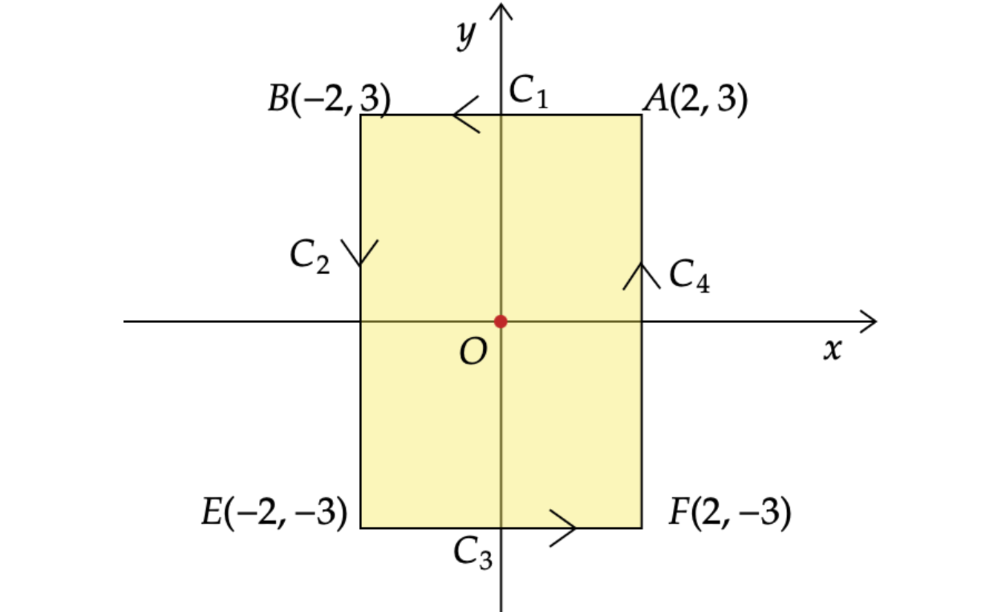
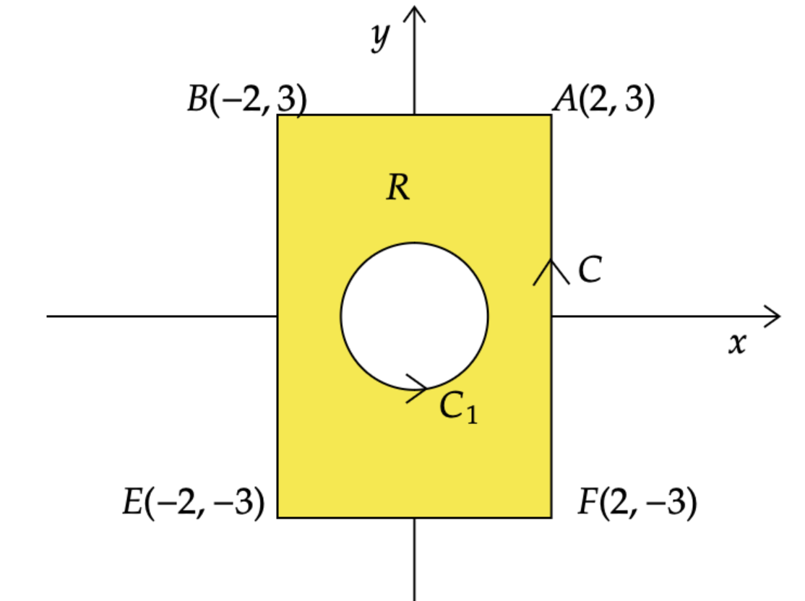
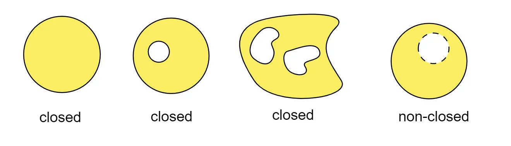

# Similar example for Discussion of Green's Theorem (4)

## Question:

Evaluate 
$$
\int_C\frac{x}{x^2+y^2}dy-\frac{y}{x^2+y^2}dx$$

where $C$ is the rectangular curve with vertices $(2,3)$,$(-2,3)$,$(-2,-3)$,$(2,-3)$, taken in the anti-clockwise direction.

<!--more-->

## Discussion:

### Idea 1:
The curve $C$ consists of $C_1 :y=3, 2\leq x \leq -2$,$C_2 :x=-2, 3\leq y \leq -3$, $C_3 :y=3, -2\leq x \leq 2$,$C_4 :x=2, -3\leq y \leq 3$, and the diagram is given as below:

Hence,



$$
\begin{aligned}
& \quad \int_C\frac{x}{x^2+y^2}dy-\frac{y}{x^2+y^2}dx \\
& =\int_{C_1+C_2+C_3+C_4}\frac{x}{x^2+y^2}dy-\frac{y}{x^2+y^2}dx \\
& =\int_{C_1}\frac{x}{x^2+y^2}dy-\frac{y}{x^2+y^2}dx + \int_{C_2}\frac{x}{x^2+y^2}dy-\frac{y}{x^2+y^2}dx \\
& \quad + \int_{C_3}\frac{x}{x^2+y^2}dy-\frac{y}{x^2+y^2}dx + \int_{C_4}\frac{x}{x^2+y^2}dy-\frac{y}{x^2+y^2}dx \\
& =\int_{2}^{-2}-\frac{3}{x^2+9}dx \;+\;\int_{3}^{-3}\frac{-2}{4+y^2}dy \;+\;\int_{-2}^{2}-\frac{-3}{x^2+9}dx \;+\; \int_{-3}^{3}\frac{2}{4+y^2}dy \\
& =\int_{-2}^{2}\frac{3}{x^2+9}dx \;+\;\int_{-3}^{3}\frac{2}{4+y^2}dy \;+\;\int_{-2}^{2}\frac{3}{x^2+9}dx \;+\; \int_{-3}^{3}\frac{2}{4+y^2}dy \\
& =2 \Big(\int_{-2}^{2}\frac{3}{x^2+9}dx \;+\;\int_{-3}^{3}\frac{2}{4+y^2}dy \Big) \\
& =4 \Big(\int_{0}^{2}\frac{3}{x^2+9}dx \;+\;\int_{0}^{3}\frac{2}{4+y^2}dy \Big) \\
& =4 \Big(\frac{1}{3} \int_{0}^{2} \frac{1} {(\frac{x}{3})^2+1}dx + \frac{1}{2} \int_{0}^{3}\frac{1}{1+(\frac{y}{2})^2}dy\Big) \\
& =4 \Big(\int_{0}^{2}\frac{1}{(\frac{x}{3})^2+1}d\Big(\frac{x}{3}\Big) + \int_{0}^{3}\frac{1}{1+(\frac{y}{2})^2}d\Big(\frac{y}{2}\Big) \Big) \\
& =4\Big(\arctan\Big(\frac{x}{3}\Big)\Big|_{x=0}^{x=2} + \arctan\Big(\frac{y}{2}\Big)\Big|_{y=0}^{y=3}\Big) \\
& =4 \Big(\arctan\Big(\frac{2}{3}\Big) + \arctan\Big(\frac{3}{2}\Big)\Big) \\
& =4 \Big(\frac{\pi}{2}\Big)=2{\pi}
\end{aligned}
$$


Idea 2 & 3
 
The corresponding domain $D$ enclosed by $C$ is given as below:

Next,



$$
\int_C\frac{x}{x^2+y^2}dy-\frac{y}{x^2+y^2}dx=\int_C
\begin{pmatrix}
\frac{-y}{x^2+y^2}\\
\frac{x}{x^2+y^2}
\end{pmatrix}
\cdot
\begin{pmatrix}
dx\\
dy
\end{pmatrix}
=\int_C F \cdot dr,$$


where $F=\begin{pmatrix}\frac{-y}{x^2+y^2}\\\ \frac{x}{x^2+y^2}\end{pmatrix}=\begin{pmatrix}P\\\ Q\end{pmatrix}$, $dr=\begin{pmatrix} dx\\ dy\end{pmatrix}$, and $r=r(t)$ is the parametric equation of the curve $C$.

**Note that $F$ is undefined at $(x,y)=(0,0)$**.

### Idea 2:

Assume $ F=\begin{pmatrix}P\\\ Q\end{pmatrix}$. We know $F$ is undefined at $O(0,0)$, and then  it's easy to check $P_y=Q_x$ when  $(x,y)$ is on the domain $D$ except the origin $O(0,0)$.

Thus, by the test for the conservative vector field, $F$ is conservative on $D$ except $(0,0)$, 
**NOT** on the whole region $D$ or for the each point of region $D$.

Hence, Fundamental Theorem of Line integrals is **NOT** applicable here, which is, we can not perform

$$
\int_C F \cdot dr = f(r(b))-f(r(a)).
$$


### Idea 3:

As $F$ is undefined at $O(0,0)$,the actual domain of integration in this problem should be

$$
D^*=\{(x,y): D, \text{and } (x,y) \neq (0,0)\}, 
$$


which is a rectangular region with a hole,and we call it **non-closed**.
Hence, Green's Theorem can NOT be applied directly to solve this kind of problem.
So what else shall we do?
We can draw a unit circle, $i.e. C_2:x^2+y^2=1$, where  the little hole $O(0,0)$ is within this circle, as shown in the following diagram:

Where R is is the region between $C$ and $C_1$,
and the boundary of $R$ is $\partial R=C-C_1$

By the Green's Theorem,


$$
\oint_{\partial R}  F \cdot dr =\iint_R (Q_x-P_y)dx =0, 
$$

as $P_y=Q_x$ is conservative on the region $R$.

$\implies \int_{C_-C_1}  F \cdot dr =0$,
$\implies \int_{C}F \cdot dr =\int_{C_1}F \cdot dr=2\pi$,based on the result obtained in the remark below .

#### Remark:
(1) Recall, for a vector field $F$, the line integral of $F$ along $C$ is


$$
\int_C F \cdot dr =\int_a^b F(r(t)) \cdot r'(t)\, dt.
$$


For $C_1$ in this problem, $r(t)=\begin{pmatrix}\cos t\\\ \sin t\end{pmatrix}, 0 \leq t \leq 2\pi$, and hence,


$$
\int_C\frac{xdy-ydx}{(x^2+y^2)}=\int_C F \cdot dr =\int_0^{2\pi} \begin{pmatrix} -\sin t\\\ \cos t\end{pmatrix}  \cdot \begin{pmatrix} -\sin t\\\ \cos t\end{pmatrix}\,dt 
=2 \pi,
$$


(2) One of the requirement for Green's Theorem is the domain must be closed, for example,

## Credit:
The question is from Dr. Tuan Seng Chew.

