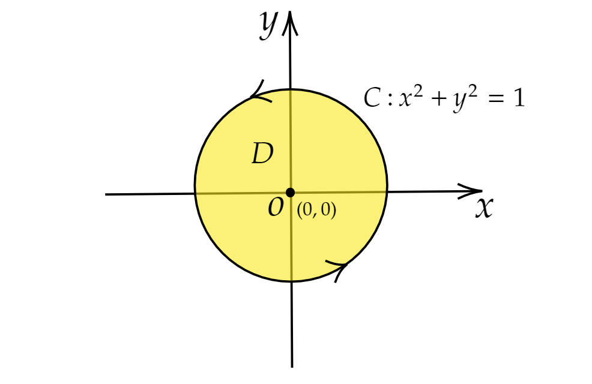
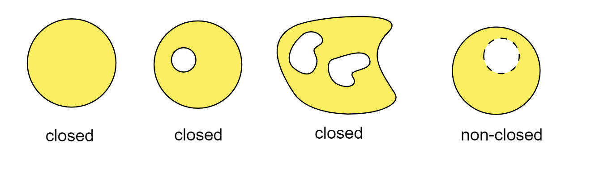

# Discussion of Green's Theorem (2)

## Question:

Evaluate 
$$
\int_C\frac{xdy-ydx}{\pi(x^2+y^2)},
$$

where $C$ is a unit circle with centre $(0,0)$, traced in the anti-clockwise direction.

<!--more-->

## Discussion:

Since the curve $C$ is given by $x^2+y^2=1$, the corresponding domain $D$ enclosed by $C$ is:
$$
D=\{(x,y): x^2+y^2\le1\}, 
$$

which is a disc without any holes.

The corresponding diagram is as below:

Next,



$$
\int_C\frac{xdy-ydx}{\pi(x^2+y^2)}=\frac{1}{\pi}\int_C
\begin{pmatrix}
\frac{-y}{x^2+y^2}\\
\frac{xdy}{x^2+y^2}
\end{pmatrix}
\cdot
\begin{pmatrix}
dx\\
dy
\end{pmatrix}
=\frac{1}{\pi}\int_C F \cdot dr,
$$



where $F=\begin{pmatrix}\frac{-y}{x^2+y^2}\\\ \frac{x}{x^2+y^2}\end{pmatrix}=\begin{pmatrix}P\\\ Q\end{pmatrix}$, $dr=\begin{pmatrix} dx\\ dy\end{pmatrix}$, and $r=r(t)$ is the parametric equation of the curve $C$.

**Note that $F$ is undefined at $(x,y)=(0,0)$**.

### Idea 1:

Recall, for a vector field $F$, the line integral of $F$ along $C$ is

$$
\int_C F \cdot dr =\int_a^b F(r(t)) \cdot r'(t)\,dt.
$$

For this problem, $r(t)=\begin{pmatrix}\cos t\\\ \sin t\end{pmatrix}, 0 \leq t \leq 2\pi$, and hence,

$$
\int_C\frac{xdy-ydx}{\pi(x^2+y^2)}=\frac{1}{\pi}\int_C F \cdot dr =\frac{1}{\pi}\int_0^{2\pi} \begin{pmatrix} -\sin t\\\ \cos t\end{pmatrix}  \cdot \begin{pmatrix} -\sin t\\\ \cos t\end{pmatrix}\,dt 
=2,
$$

### Idea 2:

Assume $ F=\begin{pmatrix}P\\\ Q\end{pmatrix}$. We know $F$ is undefined at $O(0,0)$, and then  it's easy to check $P_y=Q_x$ when  $(x,y)$ is on the domain $D$ except the origin $O(0,0)$.

Thus, by the test for the conservative vector field, $F$ is conservative on $D$ except $(0,0)$, 
**NOT** on the whole region $D$ or for the each point of region $D$.

Hence, Fundamental Theorem of Line integrals is **NOT** applicable here, which is, we can not perform 
$$
\int_C F \cdot dr = f(r(b))-f(r(a)).
$$

### Idea 3:

As $F$ is undefined at $O(0,0)$,the actual domain of integration in this problem should be 
$$
D^*=\{(x,y): x^2+y^2\le1, \text{and } (x,y) \neq (0,0)\}, 
$$

which is a disc with a hole,and we call it **non-closed**.
Hence, Green's Theorem can NOT be applied directly to solve this kind of problem.

#### Remark:

One of the requirement for Green's Theorem is the domain must be closed, for example,

## Credit:
The question is from Dr. Tuan Seng Chew.

